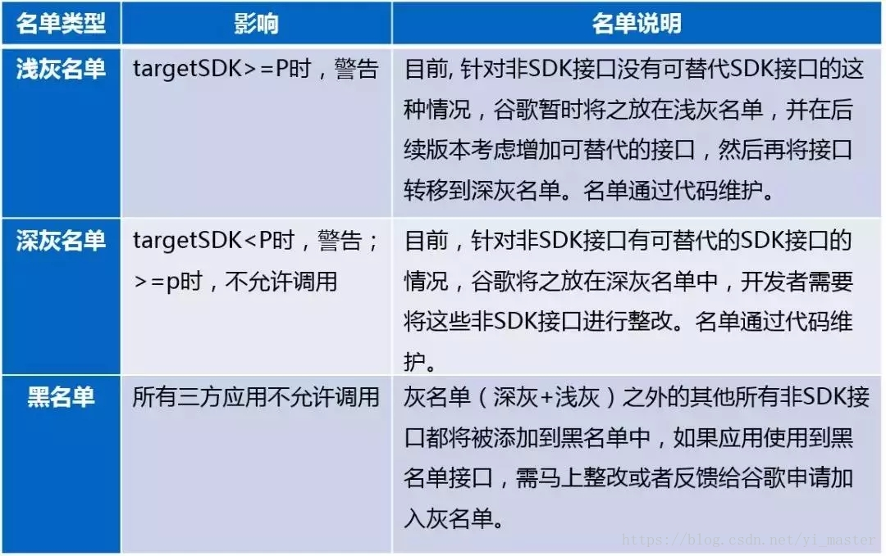

* andorid 9.0
* 渐进的改进方式
* sdk检查原理 
* 工程中已经发现需要注意的三方库

<!-- more -->
<!--  -->

## andorid 9.0 ##
```
	google终于开始解决悬在自己头上的达摩斯之剑了，安全+卡顿两个被诟病的地方；这次在nogout的p升级上，开始对sdk中被各大厂商和黑科技玩坏的反射和对底层的各种调用问题开始着手解决；这个版本对于非sdk暴露api方法做了限制，不论是调用，反射还是jni，提升自己的兼容性；
	对限制的接口进行调用的时候，会奔溃或者弹窗或者弹出toast警告的方式来一个版本一个版本的把非法的sdk调用消灭掉；
```
## 渐进的改进方式 ##
```
	对于sdk的限制，google出了几个列表，blacklist，dark-graylist， light-graylist；处理方式也有不同，对于黑名单这个版本必须改动，不然会带来奔溃；dark-graylist的接口，为p版本的时候不准调用，小于p的手机可调用，会警告；light-graylist的在》=p的版本的时候会进行警告，后续版本会移动到深灰列表中；

```
## sdk检查原理 ##
```
	start 准备阶段：
		在c层对androidsdk的api权限进行检测从编译期的几个api列表中开始：

		LOCAL_LIGHT_GREYLIST := $(INTERNAL_PLATFORM_HIDDENAPI_LIGHT_GREYLIST)
		LOCAL_DARK_GREYLIST := $(INTERNAL_PLATFORM_HIDDENAPI_DARK_GREYLIST)
		LOCAL_BLACKLIST := $(INTERNAL_PLATFORM_HIDDENAPI_BLACKLIST)

		# File names of source files we will use to generate the final API lists.
		LOCAL_SRC_GREYLIST := frameworks/base/config/hiddenapi-light-greylist.txt
		LOCAL_SRC_VENDOR_LIST := frameworks/base/config/hiddenapi-vendor-list.txt
		LOCAL_SRC_FORCE_BLACKLIST := frameworks/base/config/hiddenapi-force-blacklist.txt
		LOCAL_SRC_PUBLIC_API := frameworks/base/config/hiddenapi-public-dex.txt
		LOCAL_SRC_PRIVATE_API := frameworks/base/config/hiddenapi-private-dex.txt
		LOCAL_SRC_REMOVED_API := frameworks/base/config/hiddenapi-removed-dex.txt

		在定义light-greylist，black-list，dark-greylist中可以看出，系统开始就存储了两个列表hiddenapi-blacklist.txt，hiddenapi-dark-greylist.txt来源于Framework/base/config目录，而light-greylist来自于private-list减去dark-list和black-list表的并集之后的结果集；

	1.遍历class.dex中的函数或者字段列表
		按照：
		HiddenApiAccessFlags::kWhitelist => 0b00
		hiddenapi-light-greylist.txt=> HiddenApiAccessFlags::kLightGreylist => 0b01
		hiddenapi-dark-greylist.txt => HiddenApiAccessFlags::kDarkGreylist=> 0b10
		hiddenapi-blacklist.txt => HiddenApiAccessFlags::kBlacklist => 0b11
		的对应表将数值写入到ClassDataMethod/ClassDataField结构体中成员access_flags_原始值进行处理后重新写入
	2.最后一步，重新校验dex头部签名  Hiddenapi处理后，完成从3个文本文件数据与原始dex格式文件的合并，即生成新的dex。

	3.Art Runtime时期 将 access_flags_转换为需要的值；
		hiddenapi-light-greylist.txt (0b01)
		hiddenapi-dark-greylist.txt (0b10)
		hiddenapi-blacklist.txt (0b11)
		将转换之后的2进制值再存入进去，等待在运行期再使用；

	4.运行期：在app运行时，会校验artmethod结构体中access_flags_最高2位的值，校验的手段包括直接调用、反射、JNI获取
		0(0b00) kAllow直接放过
		1(0b01) kAllowButWarn放过，但日志警告
		2(0b10) kAllowButWarnAndToast放过，且日志警告和弹窗
		3(0b11) kDeny拒绝

	那么在用户和开发层面表现出来的现象就是：
```

## 工程中已经发现需要注意的三方库 ##
```
	作为一个已经运行了三年的工程在项目里面不可避免的引入了一些对于google不太友好的sdk进来，现在发现的是tinker和gson的低版本会造成引入比较多的非法sdkapi不过可以通过升级到最新的三方版本来进行规避；
```
## 其他很奇怪的开发版造成的适配问题 ## 
```
// Android 9.0 限制了开发者调用非官方公开API方法或接口, 关闭警告弹框
private void closeAndroidPDialog(){
    try {
        Class clazz = Class.forName("android.content.pm.PackageParser$Package");

        Constructor constructor = clazz.getDeclaredConstructor(String.class);
        constructor.setAccessible(true);
    } catch (Exception e) {
        e.printStackTrace();
    }

    try {
        Class clazz = Class.forName("android.app.ActivityThread");

        Method method = clazz.getDeclaredMethod("currentActivityThread");
        method.setAccessible(true);

        Object object = method.invoke(null);

        Field filed = clazz.getDeclaredField("mHiddenApiWarningShown");
        filed.setAccessible(true);
        filed.setBoolean(object, true);
    } catch (Exception e) {
        e.printStackTrace();
    }
}
这种方式不推荐使用，只是在最终的适配也无法满足的 mix 2s 开发版 9.0 时候特定的适配问题添加下；
```

详细分析： http://kuaibao.qq.com/s/20180327G17Y3L00?refer=spider

扫描工具： 链接: https://pan.baidu.com/s/1J6ZvwWt16imoWoODY7dWXA 提取码: 29yy 


