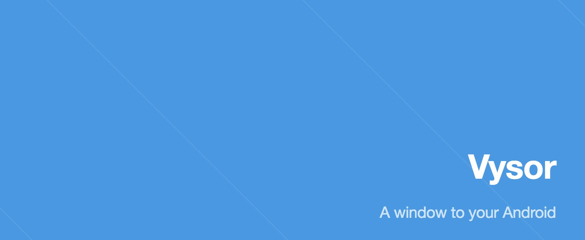
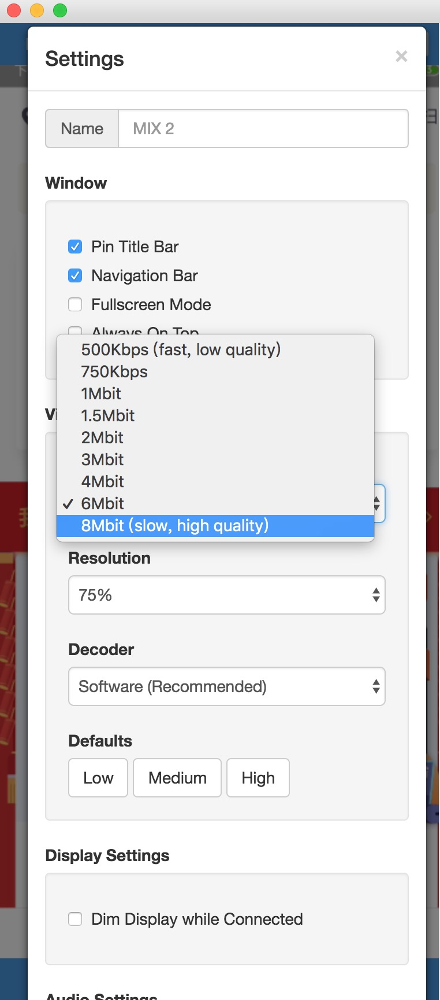

* chrome 插件vysor高清模式破解
<!-- more -->

## vysor共享手机屏幕破解 ## 
```
	chrome插件都是本地的js脚本，验证和校验是否是有效用户有V权限用户，都在本地是可以进行本地破解的；
	首先下载vysor插件 [官网](http://www.vysor.io/)
	安装完成后,打开用chrome打开 chrome://version/ 查看 个人资料路径
	例子: /Users/XXX/Library/Application Support/Google/Chrome/Default
	之后进入Extensions文件夹 找到gid带头的文件夹 里面就是插件的目录
	之后打开uglify.js 为了更直观的修改最好格式化下
	需要更改两个地方:
	第一个:
	首先查找_il 直接将后面改成true ;作者可能会重新打包所以后面的内容可能会有变动;目前我的是 _il:We.a();

	第二个:
	查找"Account Management"将上面的三个变量的值 都改成1;目前我的是: var e, t = !1,o = !1,都改成 var e = 1, t = 1,o = 1,

	之后从打开vysor:chrome://apps/
	看到变成了vysor pro就表示成功了。
	
```
