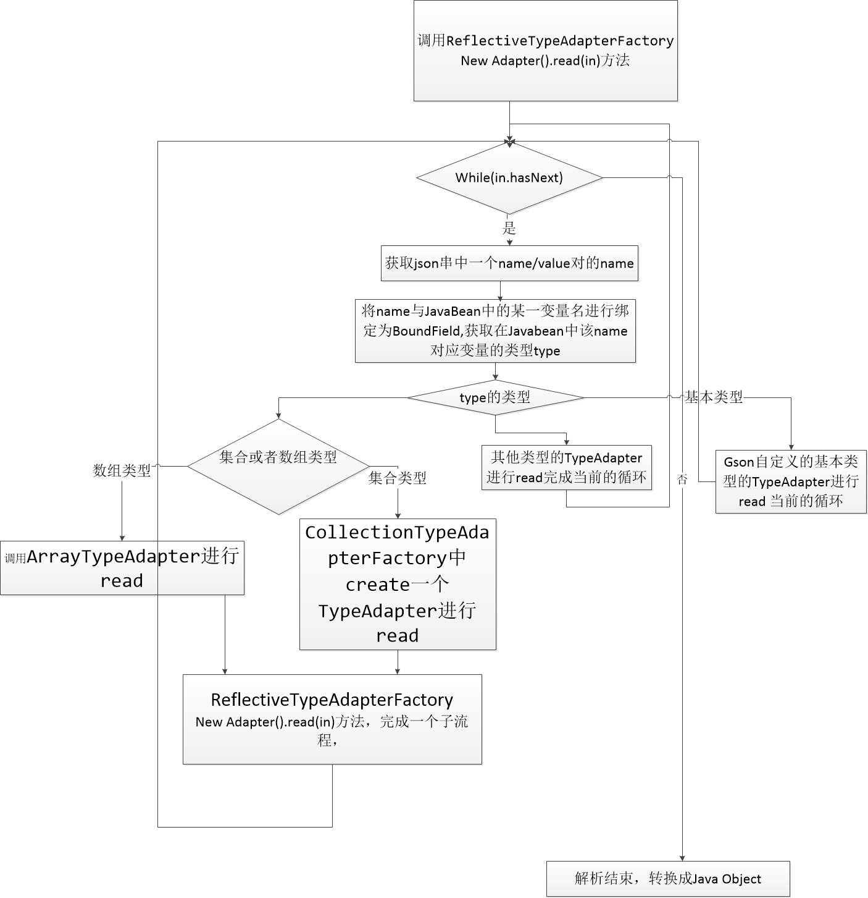

* 项目中使用了多个解析库的时候，总会遇到一些取舍，那么我们可以从原理和解析速度上面来进行取舍，同时提高基础库的了解，便于今后对库进行改动和提升操作，下面就一起来讨论一下json的序列化和反序列化库的一些区别，探讨一些库的原理；
<!-- more -->


## gson fastjson jackson ## 

```
gson fastjson jackson 三者都可以用来进行对象的序列化与反序列化操作，三者的速度对别，摘录下别人的结果，真实的结果估计也差不多，控制一下单一变量原则，对于各个序列方式擅长的方面，其实在开发中遇到的概率暂时不考虑；

序列化时间对比：

类库	样本数量	执行次数		最长时间(毫秒)	最短时间(毫秒)		平均时间(毫秒)
FastJSON	100000		10				2291.22	1416.70		1454.93
Jackson	 	100000		10				1980.92	841.91		880.82
Gson	  	100000		10				2383.02	1469.08		1520.38

反序列化对比：

类库	 		样本数量		执行次数	最长时间(毫秒)	最短时间(毫秒)	平均时间(毫秒)
FastJSON	100000		10		7942.31			340.55			6526.41
Jackson		100000		10		7957.22			6623.85			6815.41
Gson		100000		10		8235.15			7006.06			7364.75

从序列化和反序列化的表现来看，三种方案速度相差不是很大，所以在项目中已经使用了fastjson作为业务解析，gson用在了底层解析的时候，应该直接选取其中一种解析方式即可，不需要凭空在引进集中方案来增加包体积;

```

##  gson与fastjson  ##
```
	两种序列化方案是不应该放到一起的，毕竟对于速度相差不多，在不考虑易用性的时候，其实何种解析方案都可；鉴于gson被放到了网络底层来进行了数据的解析，那么我们最终选择了gson来进行序列化，而且渐渐是需要移除掉fastjson的依赖的；
	下面简单对比一下fastjson和gson在原理上的差异；
```
	gson解析原理：

	
```
	gson主要是通过遍历json和对象中的字段，遍历json进行类型判断，调取响应的TypeAdapter对象，再去bean中找到相对应的字段name生成一个boundfield，后续通过typeadapter进行数值的存入操作；直到解析结束，形成一个javabean，那么我们很容易就找到了gson会发生错误的最根本原因，在循环阶段就已经判断出来的字段类型，获取到bean中对应的typeadapter之后，尝试进行类型的转换时候，类型转换失败，自然会报出gson的一个自定义异常JsonSyntaxException，这个异常主要是针对于在类型强转过程中，统一catch之后，包装到自定义异常类中抛给调用方；
```
```
	fastjson解析原理：
	基于反射，在解析过程中，经过预测算法优化，加上各种缓存来提升速度；
```
## json解析取舍 ##
```
	两种解析在根本上，速度不会相差太大，那么只需要保留一种解析即可，没有必要维护多个库，gson已经被使用到了网络库的底层中，那么最方便的方式就是去掉fastjson的解析库；只保留gson的解析方式；
```


