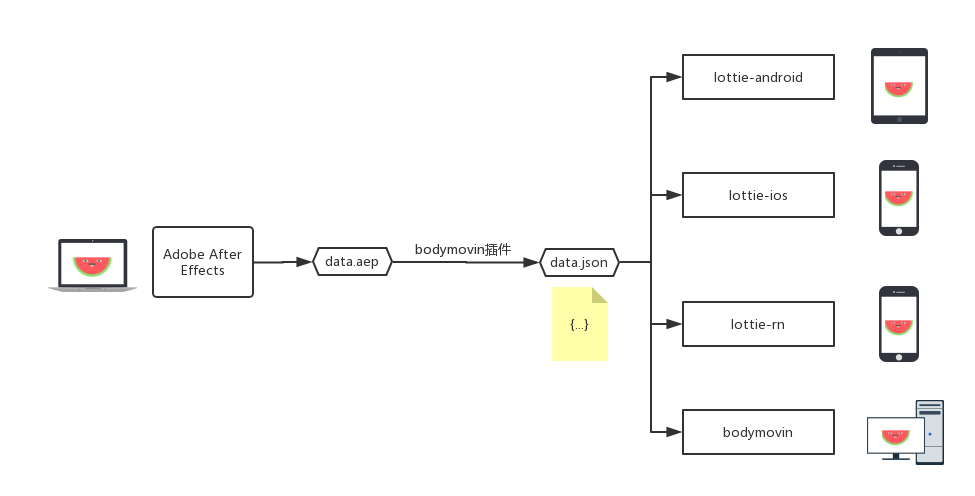

* 这个技术解决了什么问题
* 适合在哪种场景使用
* 这个技术跟我已经掌握的哪个知识或技能类似，有什么差别、有什么特点、 有什么优点和缺点
* 上代码例子
<!-- more -->
<!--  -->
## 这个技术解决了什么问题 ## 

	控件或者是元素在移动端的实现一直都是比较麻烦，而且收效不高的地方。（如果是手势或者是联动之内的动画不在讨论范围内），设计给出的一些效果，每次的沟通也会产生信息的衰减，那么爱彼迎在这基础上，给出了一套可以让设计师直接能给出一手的效果文件，经过客户端的转换成一个他想要的动画；
	lottie能够解决以下的一些问题：
		1.android ， ios ， rn 对于某一个动画效果实现两次；
		2.设计师表述的效果，跟实际沟通之间的问题，或者给出的动画实例实现有误差；
		3.复杂的动画，实现耗时长；

适用：

## 适合在哪种场景使用 ## 

	适用场景：
		1.稍复杂的动画，糅合了各种animation和animator的动画 
		2.其他懒得实现的场景。。。。 

## 这个技术跟我已经掌握的哪个知识或技能类似，有什么差别、有什么特点、 有什么优点和缺点  ##

	lottie从根本上还是一个对于图片元素的动画执行路径和执行时间的一个json文件描述转换成animation动画。那么从实现的机制上来说本身就有自己的局限性的，很多涉及到手势操作和animator的操作都无法好的进行适配；本质上是一系列的animationset的集合，需要透明度的实现还需要图片来进行支持，需要开发者自己指定mask图片的本地assert路径；
	
	缺点：
		1.lottie类似animation，所以lottie动画本身的scale都是动画变动，真是占用的区域还是文件描述的宽高(需要有缩放之内动画的要么端自己实现，要么就直接按照缩放之前之后的宽高，另行设置点击事件；)
		2.对于涉及到mask ， mattes的动画，实现需要有些注意点；
		3.对于recyclerview支持不是很好，对于新能会有影响；（尤其是涉及到mask，mattes相应的动画）
		4.死动画，无法根据业务的数据变化来进行动态的变化；
	优点：
		1.轻量，整个包只有700多个方法
		2.两端实现成本会低一些；
		3.动画效果实现度高，设计师设计即所得；
		

原理解析：
Lottie使用json文件来作为动画数据源，json文件是通过Bodymovin插件导出的，查看sample中给出的json文件，其实就是把图片中的元素进行来拆分，并且描述每个元素的动画执行路径和执行时间。Lottie的功能就是读取这些数据，然后绘制到屏幕上。

首先要解析json，建立数据到对象的映射，然后根据数据对象创建合适的Drawable绘制到view上，动画的实现可以通过操作读取到的元素完成。

具体过程如下所示

json文件——>Component——>Drawable——>View

通过如下3个核心类来来完成整个工作流程，因而使用起来比较简单

LottieComposition(json->数据对象)
Lottie使用LottieComposition来作为After Effects的数据对象，即把Json文件映射为到LottieComposition，该类中提供了解析json的静态方法

LottieDrawable(数据对象->Drawable)
绘制

LottieAnimationView（绘制）
操作集合，LottieAnimationView 继承自 AppCompatImageView，封装了一些动画的操作，具体的绘制时委托为 LottieDrawable 完成的

## 上酸菜，咳咳，上代码例子 ## 
